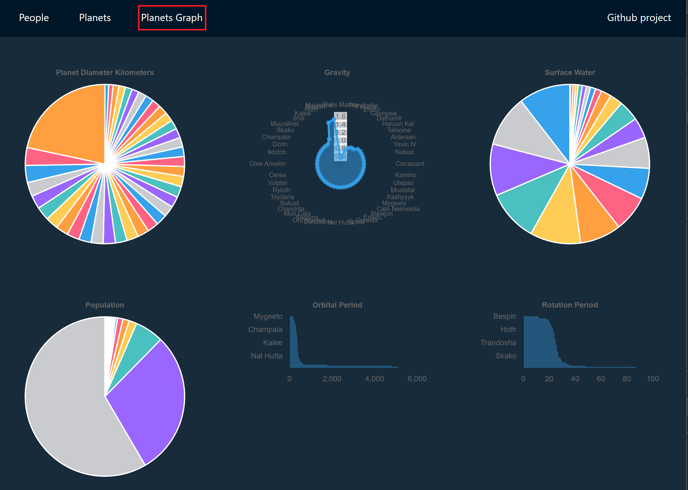

# single-spa-example

Example of a microfrontend architecture using the single-spa framework.

This repo extends the examples provided from the [react-microfrontends](https://github.com/react-microfrontends) organisation.

[root-config](./root-config/package.json) - 9000
[api](./api/package.json) - 8000
[navbar](./navbar/package.json) - 8001
[people](./people/package.json) - 8002
[planets](./planets/package.json) - 8003
[planets-graph](./planets-graph/package.json) - 8004
[styleguide](./styleguide/package.json) - 8005

[importmap](./shared-dependencies/importmap.json) example

## Issues encountered

- The [original examples](https://react.microfrontends.app) are down so it's unable to load the [importmap.json](https://storage.googleapis.com/react.microfrontends.app/importmap.json). Instead I've temporarily pointed the root-config to this repositories [shared-dependencies](./shared-dependencies/importmap.json) raw file.

- Upgrade package [webpack-config-single-spa-react](https://www.npmjs.com/package/webpack-config-single-spa-react)@2.0.0 -> 4.0.5 for each package due to webpack config errors.

- Swapped [@reach/router](https://www.npmjs.com/package/@reach/router) for [react-router-dom](https://www.npmjs.com/package/react-router-dom), in navbar package, as it appears to be inactive and peer dependencies are out of date.

## New planets-graph package

The new [planets-graph](./planets-graph/package.json) package simply adds a new route to the application that displays planet data as a series of charts. The package currently uses a delay to load the paginated planets api data to simulate a data load.

### Improvements

- Similar to the current packages theres little to no unit tests. It would make a lot of sense to implement tests when considering the concept of [single-spa](https://single-spa.js.org/) architecture.

- To improve the development experience in isolation it would make sense to implement Storybook.
